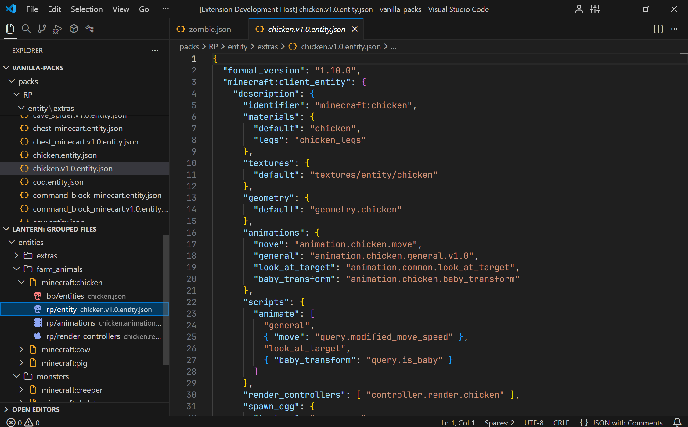
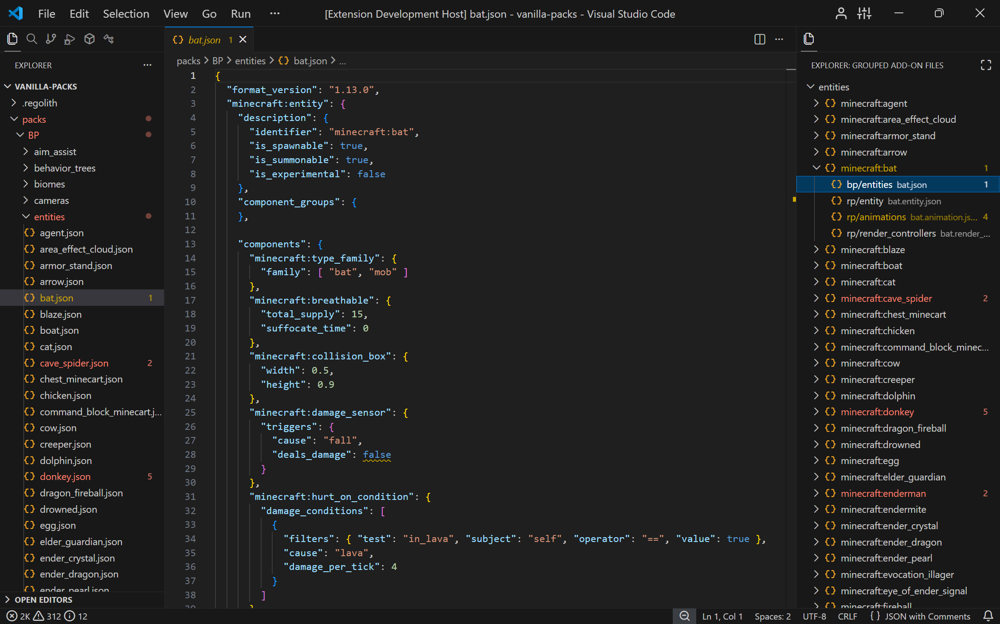
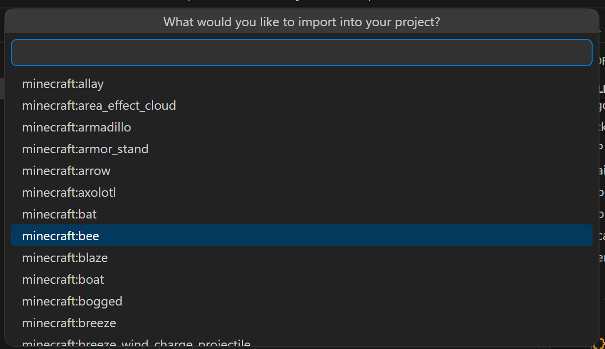

# Lantern for Minecraft Bedrock
A proper IDE experience for Bedrock Add-Ons. Create add-ons efficiently by cutting out time scrolling through folders and manipulating files.

## Features
### Grouped Files
This extension adds a new view within the explorer which groups Minecraft Bedrock Add-On Files by identifier.

It currently groups files linked to entities and items.

In the below picture, it shows all files linked to the chicken in the vanilla packs. The group view is in the secondary sidebar. 



In the below picture, it shows all files linked to the zombie in the vanilla packs. The group view is in the same panel as the explorer.



### Import from Vanilla Packs
If you right click on a directory in the entity section of the grouped files panel you can select `Import Entity from Vanilla`. A UI will come up which allows you to rename the identifier and files linked to the entity.

You can also run this using the command pallete under the command `Lantern: Import Entity from Vanilla`



This will download everything that links to the entity e.g. animations, render controllers

### Linking scripts to entities/items

Scripts aren't tied to a single identifier, so you link them explicitly with a `@lantern-links-*` comment placed directly above the code it relates to:

```ts
import { world } from "@minecraft/server"

// @lantern-links-entities ["custom:goblin"]
world.afterEvents.entityDie.subscribe((event) => {
    if (event.deadEntity.typeId === "custom:goblin") {
        // ...goblin death logic
    }
})

// @lantern-links-items ["custom:ruby"]
world.afterEvents.itemUse.subscribe((event) => {
    if (event.itemStack.typeId === "custom:ruby") {
        // ...ruby use logic
    }
})


// @lantern-links-blocks ["custom:slab"]
world.afterEvents.placeBlock.subscribe((event) => {
    if (event.block.typeId === "custom:ruby") {
        // ...slab use logic
    }
})
```

This file now shows up as a child of `custom:goblin` and `custom:ruby` in the Lantern view.

List several ids in one comment to link them all e.g. `// @lantern-links-entities ["custom:goblin", "custom:goblin_king"]`.

The fastest way to add one: put your cursor on the relevant line in a `.ts`/`.js` file and right-click → **Link to Entity/Item/Block**; the comment is inserted just above.

## Requirements

You must have a `config.json` file at the root of the project with the following keys:

```json
{
	"packs": {
		"behaviorPack": "./packs/BP",
		"resourcePack": "./packs/RP"
	}
}
```

This conforms to the Bedrock OSS [Project Config Standard](https://github.com/Bedrock-OSS/project-config-standard/).

If you have opened an existing `regolith`/`dash`/`bridge`/`bedrockcli` project then you will already have this within your project.

<!-- ## Extension Settings -->

## For more information

- [Release Notes](CHANGELOG.md)
- [Repository](#)

## Attribution
- The icons in the sidebar were taken from [SirLich/bedrock-addon-icons](https://github.com/SirLich/bedrock-addon-icons/tree/master) [[LICENSE](https://github.com/SirLich/bedrock-addon-icons/blob/master/LICENSE)]

- This includes icons from Godot. [[LICENSE](https://github.com/godotengine/godot/blob/master/LICENSE.txt)]

- File and folder icons are taken from [microsoft/vscode-codicons](https://github.com/microsoft/vscode-codicons) [[LICENSE](https://github.com/microsoft/vscode-codicons/blob/main/LICENSE)]